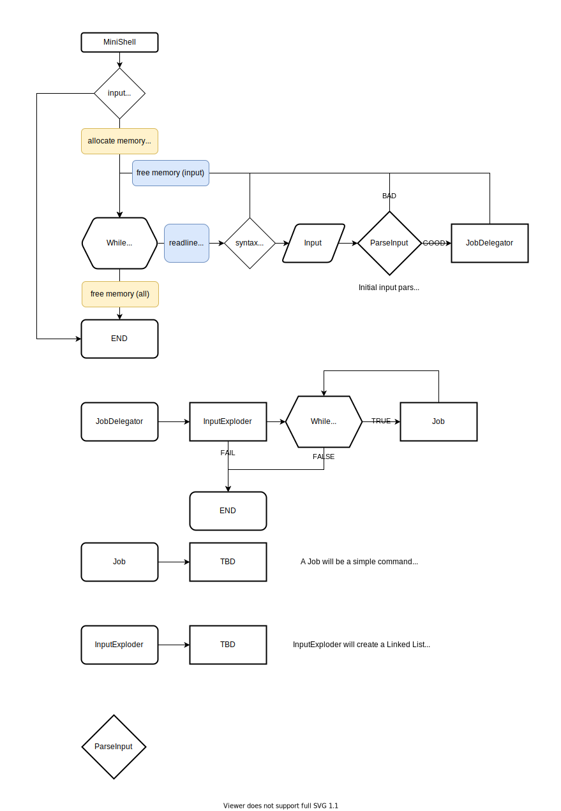

# Minishell 

This project is a simple shell.

## Mark:

# Reference Information:
https://www.cs.purdue.edu/homes/grr/SystemsProgrammingBook/Book/Chapter5-WritingYourOwnShell.pdf

# Initial Flowchart Diagram

## Job Delegator Example Flowchart

## Job Flowchart

## Debug a Child process
    
    set detach-on-fork off
    set follow-fork-mode child

https://unix.stackexchange.com/questions/79888/what-exactly-happens-when-a-built-in-command-is-run-in-a-shell
